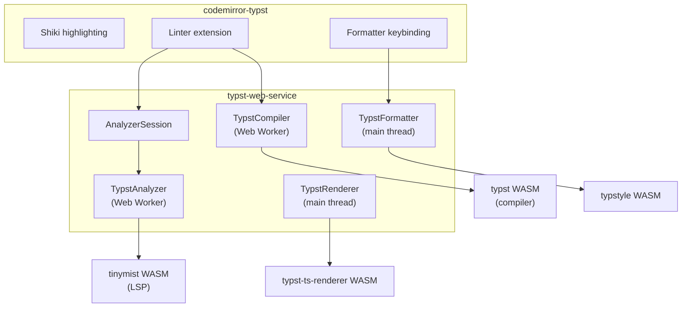

# typst-web

## Features

### `typst-web-service`

- **Compilation** — compile Typst source to vector artifacts, SVG, or PDF via WASM in a Web Worker
- **Diagnostics** — full diagnostic reporting (errors, warnings, info) with source ranges
- **LSP analysis** — optional [tinymist](https://github.com/Myriad-Dreamin/tinymist) integration for diagnostics, completion, and hover
- **Multi-file projects** — compile across multiple files with `@preview/` package support
- **SVG preview** — live SVG rendering via `@myriaddreamin/typst-ts-renderer`
- **PDF export** — render to PDF and download
- **Code formatting** — format documents or ranges via [typstyle](https://github.com/typstyle-rs/typstyle)

### `codemirror-typst`

- **Syntax highlighting** — Shiki-based highlighting with configurable themes
- **Inline diagnostics** — maps Typst/LSP diagnostics to CodeMirror lint markers with gutter icons
- **Format keybinding** — Shift+Alt+F to format the document or current selection
- **Format on save** — optional Ctrl+S / Cmd+S formatting with a save callback hook

## Packages

| Package                                                    | Purpose                                                             |
| ---------------------------------------------------------- | ------------------------------------------------------------------- |
| [`@vedivad/typst-web-service`](packages/typst-web-service) | Core worker-backed Typst compile/render/analyze service + formatter |
| [`@vedivad/codemirror-typst`](packages/codemirror-typst)   | CodeMirror 6 extension for highlighting, linting, and formatting    |

## Usage

### `typst-web-service`

Four independent classes, each wrapping a WASM module with lazy loading:

| Class            | Runs on     | Purpose                                                        |
| ---------------- | ----------- | -------------------------------------------------------------- |
| `TypstCompiler`  | Web Worker  | `compile()` → diagnostics + vector, `compilePdf()` → PDF bytes |
| `TypstRenderer`  | Main thread | `renderSvg(vector)` → SVG string                               |
| `TypstFormatter` | Main thread | `format(source)`, `formatRange(source, start, end)`            |
| `TypstAnalyzer`  | Web Worker  | LSP diagnostics, completion, hover via tinymist                |

#### Compile and render SVG

```ts
import { TypstCompiler, TypstRenderer } from "@vedivad/typst-web-service";

const compiler = new TypstCompiler();
const renderer = new TypstRenderer();

const result = await compiler.compile("= Hello, Typst");
if (result.vector) {
  const svg = await renderer.renderSvg(result.vector);
  document.querySelector("#preview")!.innerHTML = svg;
}

compiler.destroy();
```

#### Multi-file compilation

```ts
const result = await compiler.compile({
  "/main.typ": '#import "template.typ": greet\n#greet("World")',
  "/template.typ": "#let greet(name) = [Hello, #name!]",
});
```

#### PDF export

```ts
const pdf = await compiler.compilePdf("= Hello, Typst");
const blob = new Blob([pdf.slice()], { type: "application/pdf" });
const url = URL.createObjectURL(blob);

const a = document.createElement("a");
a.href = url;
a.download = "output.pdf";
a.click();

URL.revokeObjectURL(url);
```

#### Code formatting

`TypstFormatter` is standalone — it does not require a compiler or Web Worker.

```ts
import { TypstFormatter } from "@vedivad/typst-web-service";

const formatter = new TypstFormatter({ tab_spaces: 2, max_width: 80 });

// Format an entire document
const formatted = await formatter.format(source);

// Format a selection (indices are UTF-16 code units, matching JS string indexing)
const result = await formatter.formatRange(source, selectionStart, selectionEnd);
// result.text — the formatted text
// result.start, result.end — the actual range that was formatted
```

#### Format configuration

`TypstFormatter` accepts any subset of [typstyle's config](https://github.com/typstyle-rs/typstyle):

| Option                    | Type      | Default | Description                                     |
| ------------------------- | --------- | ------- | ----------------------------------------------- |
| `tab_spaces`              | `number`  | `2`     | Spaces per indentation level                    |
| `max_width`               | `number`  | `80`    | Maximum line width                              |
| `blank_lines_upper_bound` | `number`  | —       | Max consecutive blank lines                     |
| `collapse_markup_spaces`  | `boolean` | —       | Collapse whitespace in markup to a single space |
| `reorder_import_items`    | `boolean` | —       | Sort import items alphabetically                |
| `wrap_text`               | `boolean` | —       | Wrap text to fit within `max_width`             |

#### LSP analysis with tinymist

`TypstAnalyzer` runs a [tinymist](https://github.com/Myriad-Dreamin/tinymist) language server in a Web Worker for richer diagnostics, completion, and hover.

```ts
import { TypstAnalyzer } from "@vedivad/typst-web-service";

const analyzer = new TypstAnalyzer({ wasmUrl: "/path/to/tinymist_bg.wasm" });
await analyzer.ready;

analyzer.onDiagnostics((uri, diagnostics) => {
  console.log(uri, diagnostics);
});

await analyzer.didChange("untitled:/project/main.typ", source);
const completions = await analyzer.completion("untitled:/project/main.typ", line, character);
const hover = await analyzer.hover("untitled:/project/main.typ", line, character);

analyzer.destroy();
```

For multi-file projects, `AnalyzerSession` handles file synchronization and ordering:

```ts
import { TypstAnalyzer, AnalyzerSession } from "@vedivad/typst-web-service";

const analyzer = new TypstAnalyzer({ wasmUrl: "/path/to/tinymist_bg.wasm" });
const session = new AnalyzerSession({ analyzer, entryPath: "/main.typ" });

await session.sync("/main.typ", source, files);
```

### `codemirror-typst`

#### Single-file editor

```ts
import { EditorView, basicSetup } from "codemirror";
import { EditorState } from "@codemirror/state";
import {
  createTypstExtensions,
  TypstCompiler,
  TypstFormatter,
} from "@vedivad/codemirror-typst";

const compiler = new TypstCompiler();

const typstExtensions = await createTypstExtensions({
  compiler: { instance: compiler },
  highlighting: { theme: "dark" },
  formatter: {
    instance: new TypstFormatter({ tab_spaces: 2, max_width: 80 }),
  },
  onDiagnostics: (diagnostics) => console.log(diagnostics),
});

new EditorView({
  parent: document.querySelector("#app")!,
  state: EditorState.create({
    doc: "= Typst",
    extensions: [basicSetup, ...typstExtensions],
  }),
});
```

#### Multi-file editor with tinymist

For multi-file projects, share a single `TypstCompiler` across editors. Each editor declares its `filePath` and provides a `getFiles` getter. Adding a `TypstAnalyzer` enables autocompletion, hover, and push-based diagnostics.

```ts
import {
  createTypstExtensions,
  TypstAnalyzer,
  TypstCompiler,
  TypstFormatter,
  TypstRenderer,
} from "@vedivad/codemirror-typst";

const compiler = new TypstCompiler();
const renderer = new TypstRenderer();
const analyzer = new TypstAnalyzer({ wasmUrl: "/path/to/tinymist_bg.wasm" });
const formatter = new TypstFormatter({ tab_spaces: 2, max_width: 80 });

const files: Record<string, string> = {
  "/main.typ": "...",
  "/template.typ": "...",
};

const typstExtensions = await createTypstExtensions({
  filePath: "/main.typ",
  getFiles: () => files,
  compiler: {
    instance: compiler,
    onCompile: async (result) => {
      if (result.vector) {
        const svg = await renderer.renderSvg(result.vector);
        document.querySelector("#preview")!.innerHTML = svg;
      }
    },
  },
  analyzer: { instance: analyzer },
  formatter: { instance: formatter, formatOnSave: true },
  highlighting: { theme: "dark" },
  onDiagnostics: (d) => console.log(d),
});
```

Compiler diagnostics are always returned from the linter. When `analyzer` is provided, tinymist analyzes in the background and its push-based diagnostics replace the compiler ones once they arrive.

#### Format on save

Enable `formatOnSave` to format the document on Ctrl+S / Cmd+S. Pass a callback to hook into the save event:

```ts
// Format on save, no callback
formatter: { instance: formatter, formatOnSave: true }

// Format on save with a callback
formatter: {
  instance: formatter,
  formatOnSave: (content) => {
    fetch("/api/save", { method: "POST", body: content });
  },
}
```

## Development

### Prerequisites

- [Bun](https://bun.sh) — workspace scripts and package builds
- [just](https://just.systems) — task runner (optional, `bun run` scripts also work)

### Commands

| Command        | Description                                       |
| -------------- | ------------------------------------------------- |
| `just install` | Install dependencies                              |
| `just build`   | Build both packages                               |
| `just test`    | Run tests with [Vitest](https://vitest.dev)       |
| `just format`  | Format and lint with [Biome](https://biomejs.dev) |
| `just dev`     | Build packages and start the demo dev server      |

### Testing

Tests use [Vitest](https://vitest.dev) with workspace mode — each package has its own test suite.

```bash
just test              # run all tests
just test-watch        # watch mode
```

`typst-web-service` tests load real typstyle WASM for formatter integration tests. `codemirror-typst` tests use mocked services to verify diagnostic mapping, linter plugin behavior, and formatter error handling.

### Demo

```bash
just dev
```

The demo at `demo/` includes a tabbed multi-file editor, live SVG preview, tinymist LSP diagnostics, diagnostics panel with source locations, PDF export, code formatting (Shift+Alt+F), and format on save (Ctrl+S).

## Architecture



- **`TypstCompiler`** manages a Web Worker running the Typst WASM compiler. It handles compilation, PDF rendering, and request coalescing. Accepts both single-file strings and multi-file `Record<string, string>` maps.
- **`TypstAnalyzer`** runs a tinymist language server in a Web Worker for LSP-based diagnostics, completion, and hover. Optional — the system works without it.
- **`AnalyzerSession`** synchronizes multi-file project state with the analyzer, handling file ordering (dependencies before entry file) and avoiding cross-file race conditions.
- **`TypstRenderer`** converts compile vector artifacts to SVG strings. Runs on the main thread with lazy WASM loading.
- **`TypstFormatter`** is a standalone formatter powered by typstyle WASM. Runs on the main thread and is independent of all other classes.
- **`codemirror-typst`** provides CodeMirror 6 extensions that consume the service classes. When both compiler and analyzer are provided, compiler diagnostics appear instantly while tinymist diagnostics arrive in the background.
- Each class is independent — consumers only import what they need.

## License

MIT - see `LICENSE`.

This project bundles `@myriaddreamin/typst.ts` and `@myriaddreamin/typst-ts-web-compiler`, licensed under Apache-2.0. See `THIRD_PARTY_LICENSES`.
