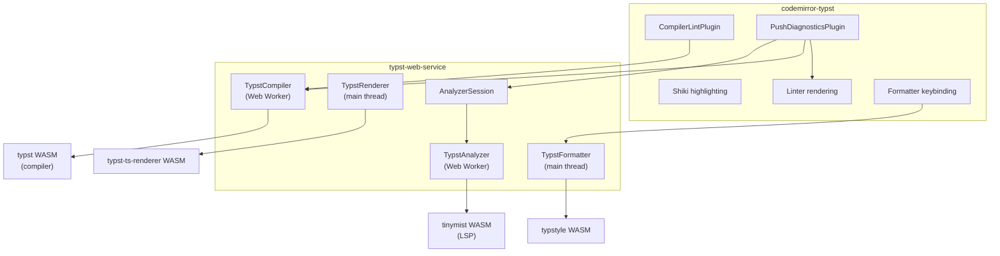

# typst-web

Typst editor components for the web — CodeMirror 6 extensions with compilation, LSP analysis, formatting, and live preview.

## Quick start

```bash
npm install @vedivad/codemirror-typst
```

> `@vedivad/codemirror-typst` re-exports everything from `@vedivad/typst-web-service` — you only need one dependency.

### Prerequisites

- A bundler with WASM support (e.g. [Vite](https://vite.dev) + [`vite-plugin-wasm`](https://github.com/nicolo-ribaudo/vite-plugin-wasm), or webpack with [`wasm-pack-plugin`](https://github.com/nicolo-ribaudo/vite-plugin-wasm))
- The formatter (`TypstFormatter`) requires the bundler to handle static WASM imports from `@typstyle/typstyle-wasm-bundler`
- The analyzer (`TypstAnalyzer`) requires a URL to the tinymist WASM binary (see [LSP analysis](#lsp-analysis-with-tinymist))

### Minimal editor

```ts
import { EditorView, basicSetup } from "codemirror";
import { EditorState } from "@codemirror/state";
import {
  createTypstExtensions,
  TypstCompiler,
} from "@vedivad/codemirror-typst";

const compiler = new TypstCompiler();

const typstExtensions = await createTypstExtensions({
  compiler: { instance: compiler },
  highlighting: { theme: "dark" },
});

new EditorView({
  parent: document.querySelector("#app")!,
  state: EditorState.create({
    doc: "= Hello, Typst!",
    extensions: [basicSetup, ...typstExtensions],
  }),
});
```

This gives you syntax highlighting, diagnostics, and compilation out of the box — no URLs or config needed.

### Full-featured editor

Add formatting, LSP analysis (autocompletion, hover, push diagnostics), and live SVG preview:

For multi-tab editors, create a shared `AnalyzerSession` and pass it to each editor. This avoids redundant file synchronization and keeps diagnostic subscriptions alive across tab switches.

```ts
import {
  AnalyzerSession,
  createTypstExtensions,
  TypstCompiler,
  TypstRenderer,
  TypstFormatter,
  TypstAnalyzer,
} from "@vedivad/codemirror-typst";
import tinymistWasmUrl from "tinymist-web/pkg/tinymist_bg.wasm?url"; // Vite

const compiler = new TypstCompiler();
const renderer = new TypstRenderer();
const formatter = new TypstFormatter({ tab_spaces: 2, max_width: 80 });
const analyzer = new TypstAnalyzer({ wasmUrl: tinymistWasmUrl });

// Create extensions for each tab, sharing the session
const typstExtensions = await createTypstExtensions({
  compiler: {
    instance: compiler,
    onCompile: async (result) => {
      if (result.vector) {
        const svg = await renderer.renderSvg(result.vector);
        document.querySelector("#preview")!.innerHTML = svg;
      }
    },
    debounceDelay: 300,
    throttleDelay: 2000,
  },
  analyzer: { instance: analyzer, session },
  formatter: { instance: formatter, formatOnSave: true },
  highlighting: { theme: "dark" },
});
```

### Multi-file editor

For multi-file projects, each editor declares its `filePath` and provides a `getFiles` getter. Share a single `AnalyzerSession` across tabs to avoid redundant file synchronization:

```ts
import {
  AnalyzerSession,
  createTypstExtensions,
  TypstAnalyzer,
  TypstCompiler,
} from "@vedivad/codemirror-typst";
import tinymistWasmUrl from "tinymist-web/pkg/tinymist_bg.wasm?url";

const compiler = new TypstCompiler();
const analyzer = new TypstAnalyzer({ wasmUrl: tinymistWasmUrl });
const session = new AnalyzerSession({ analyzer });

const files: Record<string, string> = {
  "/main.typ": "...",
  "/template.typ": "...",
};

// Create extensions for each tab, sharing the session
const extensions = await createTypstExtensions({
  filePath: "/main.typ",
  getFiles: () => files,
  compiler: { instance: compiler },
  analyzer: { instance: analyzer, session },
  highlighting: { theme: "dark" },
});
```

## Packages

| Package                                                    | Purpose                                                                            |
| ---------------------------------------------------------- | ---------------------------------------------------------------------------------- |
| [`@vedivad/codemirror-typst`](packages/codemirror-typst)   | CodeMirror 6 extensions — highlighting, diagnostics, completion, hover, formatting |
| [`@vedivad/typst-web-service`](packages/typst-web-service) | Editor-agnostic Typst services — compile, render, analyze, format via WASM         |

## Service classes

Four independent classes, each wrapping a WASM module with lazy loading:

| Class            | Runs on     | WASM loading            | Purpose                                                  |
| ---------------- | ----------- | ----------------------- | -------------------------------------------------------- |
| `TypstCompiler`  | Web Worker  | CDN (automatic)         | `compile()` → diagnostics + vector, `compilePdf()` → PDF |
| `TypstRenderer`  | Main thread | CDN (automatic)         | `renderSvg(vector)` → SVG string                         |
| `TypstFormatter` | Main thread | Bundler (static import) | `format(source)`, `formatRange(source, start, end)`      |
| `TypstAnalyzer`  | Web Worker  | User-provided `wasmUrl` | LSP diagnostics, completion, hover via tinymist          |

Each class is independent — import only what you need.

### Compilation

```ts
import { TypstCompiler, TypstRenderer } from "@vedivad/codemirror-typst";

const compiler = new TypstCompiler();
const renderer = new TypstRenderer();

// Single file
const result = await compiler.compile("= Hello, Typst");
if (result.vector) {
  const svg = await renderer.renderSvg(result.vector);
  document.querySelector("#preview")!.innerHTML = svg;
}

// Multi-file
const result = await compiler.compile({
  "/main.typ": '#import "template.typ": greet\n#greet("World")',
  "/template.typ": "#let greet(name) = [Hello, #name!]",
});

// PDF export
const pdf = await compiler.compilePdf("= Hello, Typst");
const blob = new Blob([pdf.slice()], { type: "application/pdf" });

compiler.destroy();
```

### Formatting

Requires a bundler that supports WASM imports (e.g. Vite + `vite-plugin-wasm`).

```ts
import { TypstFormatter } from "@vedivad/codemirror-typst";

const formatter = new TypstFormatter({ tab_spaces: 2, max_width: 80 });
const formatted = await formatter.format(source);
const rangeResult = await formatter.formatRange(source, start, end);
```

Config options ([typstyle docs](https://github.com/typstyle-rs/typstyle)):

| Option                    | Type      | Default | Description                         |
| ------------------------- | --------- | ------- | ----------------------------------- |
| `tab_spaces`              | `number`  | `2`     | Spaces per indentation level        |
| `max_width`               | `number`  | `80`    | Maximum line width                  |
| `blank_lines_upper_bound` | `number`  | —       | Max consecutive blank lines         |
| `collapse_markup_spaces`  | `boolean` | —       | Collapse whitespace in markup       |
| `reorder_import_items`    | `boolean` | —       | Sort import items alphabetically    |
| `wrap_text`               | `boolean` | —       | Wrap text to fit within `max_width` |

### LSP analysis with tinymist

`TypstAnalyzer` runs a [tinymist](https://github.com/Myriad-Dreamin/tinymist) language server in a Web Worker. The `wasmUrl` option is required — it must point to the `tinymist_bg.wasm` binary from the `tinymist-web` package (installed automatically as a transitive dependency).

How you reference the WASM depends on your bundler:

- **Vite**: `import wasmUrl from "tinymist-web/pkg/tinymist_bg.wasm?url"`
- **Static server**: copy `node_modules/tinymist-web/pkg/tinymist_bg.wasm` to your public directory

```ts
import { TypstAnalyzer } from "@vedivad/codemirror-typst";
import tinymistWasmUrl from "tinymist-web/pkg/tinymist_bg.wasm?url";

const analyzer = new TypstAnalyzer({ wasmUrl: tinymistWasmUrl });
await analyzer.ready;

analyzer.onDiagnostics((uri, diagnostics) => {
  console.log(uri, diagnostics);
});

await analyzer.didChange("untitled:project/main.typ", source);
const completions = await analyzer.completion(
  "untitled:project/main.typ",
  line,
  character,
);
const hover = await analyzer.hover(
  "untitled:project/main.typ",
  line,
  character,
);

analyzer.destroy();
```

### Format on save

```ts
// Format on save, no callback
formatter: { instance: formatter, formatOnSave: true }

// Format on save with a callback
formatter: {
  instance: formatter,
  formatOnSave: (content) => {
    fetch("/api/save", { method: "POST", body: content });
  },
}
```

### Compile timing

Control when compilation fires after document changes with `delay` (debounce) and `throttleDelay` (throttle):

```ts
compiler: {
  instance: compiler,
  debounceDelay: 300,  // wait 300ms after typing stops
  throttleDelay: 2000, // but force a compile at least every 2s during continuous typing
}
```

| Option          | Default  | Behavior                                                                                                                                        |
| --------------- | -------- | ----------------------------------------------------------------------------------------------------------------------------------------------- |
| `debounceDelay` | `0`      | Debounce — resets on every keystroke, fires once typing pauses. `0` means compile immediately on each change.                                   |
| `throttleDelay` | disabled | Throttle — forces a compile when typing continues past this window, even if the debounce hasn't fired. Only effective when `debounceDelay` > 0. |

Both options apply to either diagnostics mode (compiler-only or analyzer).

### Diagnostics modes

- **Without `analyzer`**: diagnostics are pulled from `TypstCompiler` after each compile.
- **With `analyzer`**: diagnostics are push-only from tinymist. The linter extension renders markers but doesn't source diagnostics.

## Architecture



- **`TypstCompiler`** — Web Worker running the Typst WASM compiler. Handles compilation, PDF rendering, and request coalescing.
- **`TypstAnalyzer`** — Web Worker running tinymist for LSP diagnostics, completion, and hover. Optional.
- **`AnalyzerSession`** — Synchronizes multi-file project state with the analyzer. Handles file ordering, diagnostic subscriptions with deduplication, and combined sync+compile orchestration.
- **`TypstRenderer`** — Converts compile vector artifacts to SVG. Main thread, lazy WASM loading.
- **`TypstFormatter`** — Standalone formatter powered by typstyle WASM. Main thread.
- **`codemirror-typst`** — CodeMirror 6 extensions consuming the service classes. Single diagnostics owner per mode.

## Development

### Prerequisites

- [Bun](https://bun.sh) — workspace scripts and package builds
- [just](https://just.systems) — task runner (optional, `bun run` scripts also work)

### Commands

| Command        | Description                                                                         |
| -------------- | ----------------------------------------------------------------------------------- |
| `just install` | Install dependencies                                                                |
| `just build`   | Build both packages                                                                 |
| `just test`    | Run tests with [Vitest](https://vitest.dev)                                         |
| `just format`  | Format with [Oxc Formatter (oxfmt)](https://oxc.rs/docs/guide/usage/formatter.html) |
| `just lint`    | Lint with [Oxlint](https://oxc.rs/docs/guide/usage/linter.html)                     |
| `just dev`     | Build packages and start the demo dev server                                        |

### Demo

```bash
just dev
```

The demo at `demo/` includes a tabbed multi-file editor, live SVG preview, tinymist LSP diagnostics, diagnostics panel, PDF export, code formatting (Shift+Alt+F), and format on save (Ctrl+S).

## License

MIT — see `LICENSE`.

This project bundles `@myriaddreamin/typst.ts` and `@myriaddreamin/typst-ts-web-compiler`, licensed under Apache-2.0. See `THIRD_PARTY_LICENSES`.
